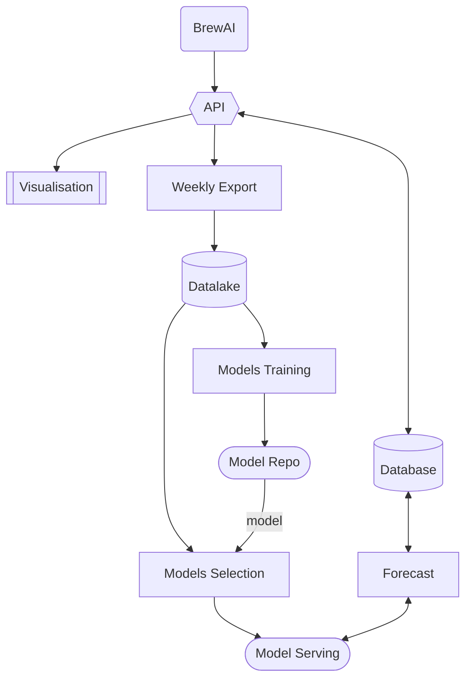
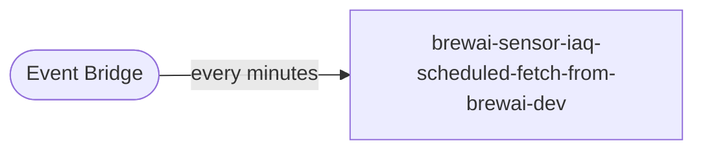
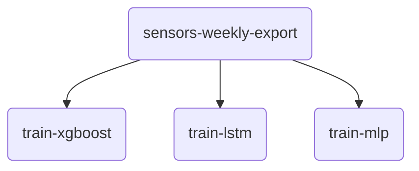

# Brew AI IAQ Project

**The goal the project:**
1. Explore infractrucure decision for
    - Ingesting sensor data
    - Store Data in a database
    - Export data as csv
    - Build ML models
    - Train models
    - Deploy model
    - Make real-time prediction on incoming data point
2. Learn how different AWS services works and how they can interact with each others
3. Explore Databricks

# Repo Organisation
```
aws/ --> aws IAAS code
databricks/ --> all databricks notebooks
    /models --> model notebooks
        /training --> training of models
        /selection --> model selection (UCB1)
    /etls --> databricks jobs
examples/ --> Some code example
static/ --> images for README
```

# Infrastructure
The infrastrucure is build using Terrafor's cdktf. It is built on top of the [FAIC AWS Template](https://github.com/MrEthic/FAIC-Project-AWS-Template).

## Solution overview


## Infrastrucure


# Database
We decided to use AWS Timestream service for our solution. According to AWS, Timestream is particularly usefull when working with sensor data.

| Pros  | Cons |
| ------------- | ------------- |
| Managed service (auto scale) | AWS Depedent |
| SQL Based | No flexibility with datamodel |
| Timeseries optimized |  |
| Built-in functions |  |
| Cost efficient |  |
| Control on how much data to keep |  |
| Memory/Magnetic store |  |

## Data model
Our database has two tables:
- sensorsdata: stores sensor's measures about air quality
- predictions: stores predictions on air quality

Both tables have the same data model as Timestream doesn't allow much flexibility:

| Attribute Name  | Description |
| ------------- | ------------- |
| time | The timestamp (utc) of the measure |
| deviceId | The device id (sensor id) of the measure |
| measure_name | Name of the measure |
| measure_value | Value of the measure |

In the sensorsdata table, measure_name is one of: iaq, temperature, humidity, voc, pressure or co2.

In the predictions table, measure_name is: `{measure_name}~{timedelta}`. For example `iaq~5` is the predicted iaq 5 minutes ago. Therefor, when inserted in the table, the predictions rows have timestamp in the future.

# API
In order to make data available to other projects, we built an API. It is also used as an abstraction layer on top of the database. People should be able to build notebooks using our data without any knowledge on how our database works.

The API is developped with API Gateway and Lambda integrations on methods. All methods are protected by API Keys (AWS).

## API Schema


## GET /sensorsdata
Get data beetween two timestamp for a specific device.

> [Lambda handler](aws/src/code/timestream_get.py)

| Parameter      | Description |
| ----------- | ----------- |
| from | Timestamp in the utc unix(s) format of the starting datetime of query |
| to | Timestamp in the utc unix(s) format of the ending datetime of query |
| device | The device id to get data from |
| (Optional) measure | Optional measure to query |

**Example**:

Query temperature of device 0 from 1/1/2022 to 30/1/2022: `GET /sensorsdata?from=1640995200&to=1643500800&device=0&measure=temperature`

**Response**
JSON
```python
{
    'Records': [
        [Objects],
        ...
    ],
    'Metadata': {
        'SourceName': String,
        'SourceType': String,
        'SourceFormat': String('Timeserie'|'Tabular'|'Text'),
        'ColumnName': [
            Strings,
            ...
        ],
        'ColumnType': [
            Strings('timestamp'|'float'|'str')
        ]
    },
    'ExecutionInfo': {
        "LastQueryId": String,
        "NextTokenConsumed": Integer,
        "NextToken": String,
    }
}
```

| Field      | Description |
| ----------- | ----------- |
| Records | List of records as list |
| Metadata | Metadata anout API |
| SourceName | Name of the source (ex: BrewAI) |
| SourceType | Type of the source (ex: SensorData) |
| SourceFormat | Format of the source, either Timeserie, Tabular or Text |
| ColumnName | List of column names (same size as records size) |
| ColumnType | List of column types (same size as records size) |
| LastQueryId | Query ID for debuging |
| NextTokenConsumed | Number of paginated queries made |
| (Optional) NextToken | Potential next token for pagination |

## PUT /sensorsdata
Insert data in database.

> [Lambda handler](aws/src/code/timestream_put.py)

**JSON Payload**
```python
{
    'devid': String(Device ID),
    'ts': String(Time of the measure),
    'readings': List[7](List of 7 readings)
}
```

## GET /sensorsdata/sensors
Get the list of unique sensors (device) ids.

> [Lambda handler](aws/src/code/sensors_get.py)

**Response**
JSON
```python
{
    'Records': [
        [String(DeviceId)],
        ...
    ],
    'Metadata': {
        'SourceName': String,
        'SourceType': String,
        'SourceFormat': String('Timeserie'|'Tabular'|'Text'),
        'ColumnName': [
            'deviceId'
        ],
        'ColumnType': [
            'str'
        ]
    },
    'ExecutionInfo': {
        "LastQueryId": String,
        "NextTokenConsumed": Integer,
        "NextToken": String,
    }
}
```

## GET /predictions
Get predictions beetween two timestamp for a specific device.

> [Lambda handler](aws/src/code/timestream_get_pred.py)

| Parameter      | Description |
| ----------- | ----------- |
| from | Timestamp in the utc unix(s) format of the starting datetime of query |
| to | Timestamp in the utc unix(s) format of the ending datetime of query |
| device | The device id to get data from |
| (Optional) measure | Optional measure to query |

**Example**:

Query predictions of iaq5 of device 0 from 1/1/2022 to 30/1/2022: `GET /sensorsdata?from=1640995200&to=1643500800&device=0&measure=iaq~5`

**Response**
JSON
```python
{
    'Records': [
        [Objects],
        ...
    ],
    'Metadata': {
        'SourceName': String,
        'SourceType': String,
        'SourceFormat': String('Timeserie'|'Tabular'|'Text'),
        'ColumnName': [
            Strings,
            ...
        ],
        'ColumnType': [
            Strings('timestamp'|'float'|'str')
        ]
    },
    'ExecutionInfo': {
        "LastQueryId": String,
        "NextTokenConsumed": Integer,
        "NextToken": String,
    }
}
```

| Field      | Description |
| ----------- | ----------- |
| Records | List of records as list |
| Metadata | Metadata anout API |
| SourceName | Name of the source (ex: BrewAI) |
| SourceType | Type of the source (ex: SensorData) |
| SourceFormat | Format of the source, either Timeserie, Tabular or Text |
| ColumnName | List of column names (same size as records size) |
| ColumnType | List of column types (same size as records size) |
| LastQueryId | Query ID for debuging |
| NextTokenConsumed | Number of paginated queries made |
| (Optional) NextToken | Potential next token for pagination |

## Usage
You can find examples on how to use the API in python in the [API Function](databricks/utils/api_functions.ipynb).

A API Key is needed, it has to be passed as a request header `{"x-api-key": API_KEY}`.

# Brew AI Data Fetcher
As we do not have sensors yet, we use an API provided by BrewAI to fetch their sensor data. This is done using a Lambda function scheduled to run every minutes by a Cloudwatch event.

## Fetcher Schema

> [Lambda code](aws/src/code/brewai_fetch.py)

## BrewAI API
Endpoint used to fetch the latest readings of all devices: `https://model.brewai.com/api/sensor_readings?latest=true`. We need to pass a token in the header: `{"Authorization": "Bearer {BREWAI_API_KEY}"}`.

# Models
Four models have been trained to predict the next 15 minutes of IAQ values. The training codes are on databricks in `/databricks/models/training`.

The models are trained every weeks (monday at 00:00 UTC+11) on the data of the last week. The databricks Job `sensors-weekly-export-and-training` is triggered every week, it runs the [sensors-weekly-export](databricks/etls/sensors-weekly-export.ipynb) etl and the training notebooks.



All models have the same signature: `(-1, 60) --> (-1, 15)`. They accept a 2D array of list of 60 iaq values and output arrays or 15 minutes predictions. The model have to handle any normalization/preprocessing itself.